To host the page on your local server type in the cli:

`python3 manage.py runserver`

To run the webpage click on this link: [by_ino_ati](https://byinoati.herokuapp.com/)

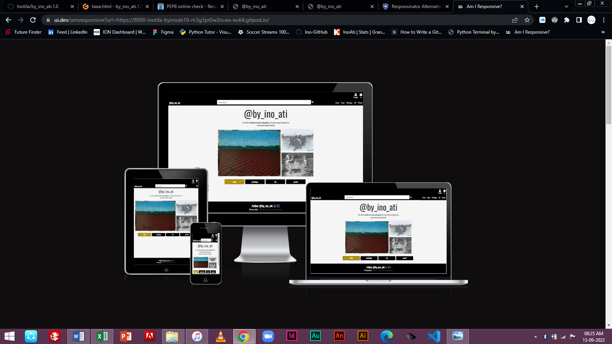
# by_ino_ati(Portfolio 5)

This project is for my final submission for my fifth milestone. The aim of the project is to code and deploy a responsive e-commerce website using Java Script, python+ django, HTML and CSS. 

## About by_ino_ati

A web application where users can view art works, interact with the art works and buy art by artist Inotila Nghaamwa (the owner of the page). 

The site owner is an artist, and would like to offer users a platform where they can view, interact and purchase his art work. In addition the owner would like to be able to handle data at the backend and manage his product by adding, removing, updating his product from the admin pannel. Furthermore, the owner would like to also be able to communicate with site users via email, so he want to give user the opportunity to sign up for a mailing list. The owner would like to keep adding features to the site and updating it to increase the way in which site users can engage with the content, the owner and each other. 

The users are primarily art enthusiasts, art collectors, and other people in the artistic community. They would like to view art works, and buy them too. These user would like to easily navigate the application and be able to interact with the content and other users on the app. Furthermore, get feedback from the app when they perform an action. In addition user want to be able to clearly view the content in a manner that they are familiar with like on applications like Instagram.

## Value

Users can easily sign-up or sign in, and this allows them to have full access to all features of the site. They can view the art works and purchase them, in well categorized pages. They payment system is an easy to system and is interactive in that it sends messages when the user action has successeed or failed. In addition, users can interact with the content by liking and commenting on it. Users also have the ability to delete and update their comments, the app has a full CRUD functionality. Users can remove items from their bag before they checkout. And they can also choose to update their delivery details in their profile page, and they can select to have the data stored when they are checking out an item. 

In addition, the UI is easy to understand and navigate. For a better UX, site user can see how many items are in their bag by looking at the top right corner of the site where a bag counter is (see image.1). Icons help the user understand what the intention of the button is such as the search icon in the nav bar, or the "x" icon that deletes comments or removes items from the bag.

The site owner has a platform to conduct recieve payments for his business, communicate with his customers, and he can also store and view data to better understand his customers.

## Potential features (before starting)
image.1

1. A grid view of art works and details view.
2. Like button.
3. Share button
4. Comment section with CRUD functionality.
5. Add items to bag.
6. Remove items from nag
7. Pay for items and recieve confirmation of payment. 
8. Live bids on art works.
9. View and review items in shopping bag.
10. A booking page where site users can book artist for a commission.
11. Social media login/signup
12. sign-up to join maillist
13. Search functionality
14. burger menu for mobile devices
15. An Admin pannel to add and remove products
16. Autheniticated login and secure user rights
17. Link to social media accounts

## Actual Features (end product)
1. A grid view of art works -

Use view art works on in catagorized grid views ( see image.2). These images when clicked will direct the user to a detailed page of the art work where users can make informed choices and add items to bag ( see image.3). All images across all catagories share this same view.

Image.2

Image.3

2. Like button. - 

Users can like and unlike individual art works. A like is indicated by the heart being fully read( see image.4), and unlike is indicated by the heart having only a black border.

Image.4

3. Comment section with CRUD functionality - 
Users have full CRUD functionality as they can create, ready, update, and delete own comments(see image.5). The can also read comments from others.

Image.5

4. Add items to bag and remove them-
User can view items in their bag, add availiable items to their bag,for checking out late (see image.6).  Users can also remove the items should they wish to do so (see image.7 ).

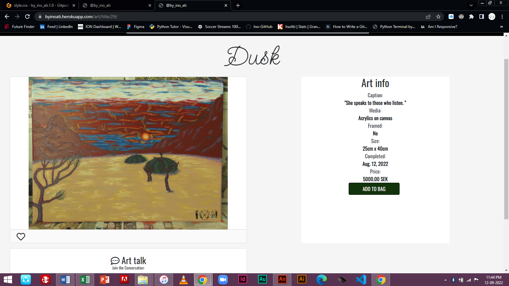
Image.6

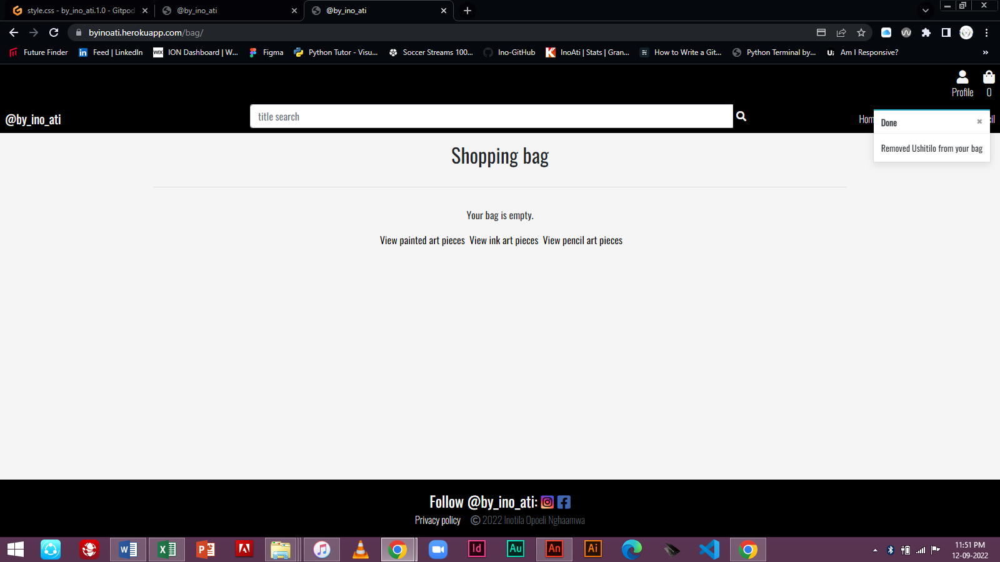
Image.6

5. Pay for items and recieve confirmation of payment - 

Site user can make secured payments and recieve email confirmation of the payment when it is processed succussfuly (see image. and image.9 )

Image.8

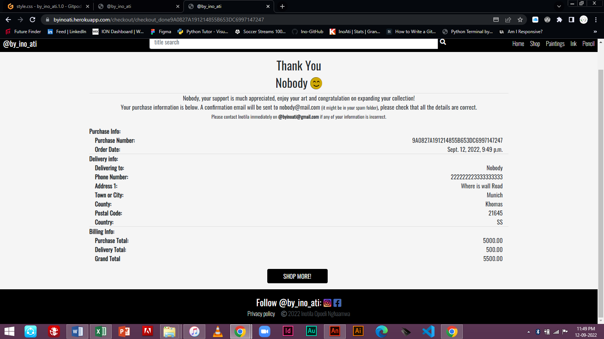
Image.9

6. An Admin pannel to add and remove products

This application that has a easy to navigate admin panel where the owner can view data and make post to the main page (see image.10 ). 

Image.10

7. Search functionalitys-

User can search for art works by their title using the search bar in the nav( see top of image.2)

8. footer-

A footer to keep social media links. These links open in new tabs to not take the user away from the website. The social media links are useful for the users because they encourage the user to get in contact with the developer on other platforms (see image.11).

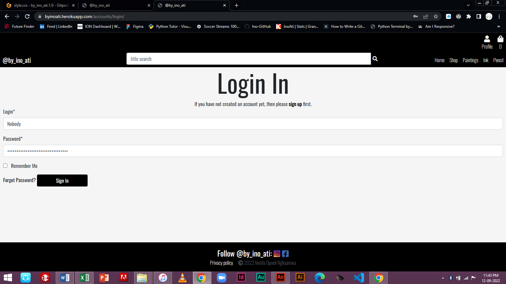
Image.11

9. Authenticated login, sign-up, and sign-out with secured user premissions - 

Users can securely sign up to the app in order to gain full site user permissions/features. The site has role based accessibilyt to certain features. Users can't access sensitive information or make any changes that are only restricted to the site adim or other users (see image.11,12, and 13).

Image.12

Image.13

10. Join Mail list-

Users can join a mailing list or opt out of it. This mailing list gives user the option of getting timely updates about new art pieces and sales that are live on the app.

The owner can user this to get data to communicate directly with site users.

11. Burger menu -
Foor better Ui/Ux the smaller screens have collapsing burger menu( see image.2).

## Future Features
1. Share button - users can share art works they like on their social media pages and contacts.
2. Live bids on art works - the site will host live bids with secure payment systems for auctions.
3. A booking page where site users can book artist for a commission - users can user a calender feature to book the artist for commision works without confiliting schedulings.
4. Social media login/signup -users can signup and login using their social media accounts.
5. A flixible grid layout - users can change the layout of the grid view on each othe catergory pages.

## Testing

Throughout the design process I did user tests with 5 individuals. These Test were a set of tasks which had an acceptance criteria for the users to achieve in order to see whether; to generally see if all the project issues were completed, the app navigation was clear, the intention of the app was clear, whether all features of the app worked, and to achieve general feedback on the UI and UX. 

The scope: 
Users could- 
1. View the content of the app.
2. If they could interact (like and comment) with the content.
3. If they could perform CRUD functionalities.
4. If they could navigate the application.
5. If all the links worked and all the buttons fire correctly.
6. If they could sign up, and sign in and out of the site.
7. If they could add an item to bag.
8. If they could remove an item from the bag.
9. if they could make a payment and receive confirmation of that payment.

Site admin could
1. Manage site products by adding, removing and updating them
2. Create, Read, Update, delete post and other site contents

Test Methodology:
All the tests performed were done manually. The users were sent a link with a list of instructions and they reported back their results ( see images.14 ).

Image.14

 
### User test

According to the feedback my users gave me the navigation of the application was simple to understand and navigate, and furthermore they understood what the intention of the app was from the moment they landed on the home page. User were asked to sign up, like a post and comment on a post. Furthermore, they were tasked with editing and then deleting a post which they did successfully. Most importantly users where asked to purchase an art piece which meant they had to user they full feautres of the site listed. The users said they enjoyed the app.

I also did these manual test and a few extra that only the admin could do to ensure that the apps features works as expected. And below are the results:

### Admin test

Figure 1: Admin panel

I created a super user to add products to the app and view data from the backend (see Figure 1). And this all worked. All theproducts on the app where upload via the admin panel and I could view users who signed up to the app,thier order, comments, and likes. In addition, I could see if they joined the mailing list or not.

### Signup, sign-in and sign-out test

Figure 2: sign-up

Figure 3: sign-out

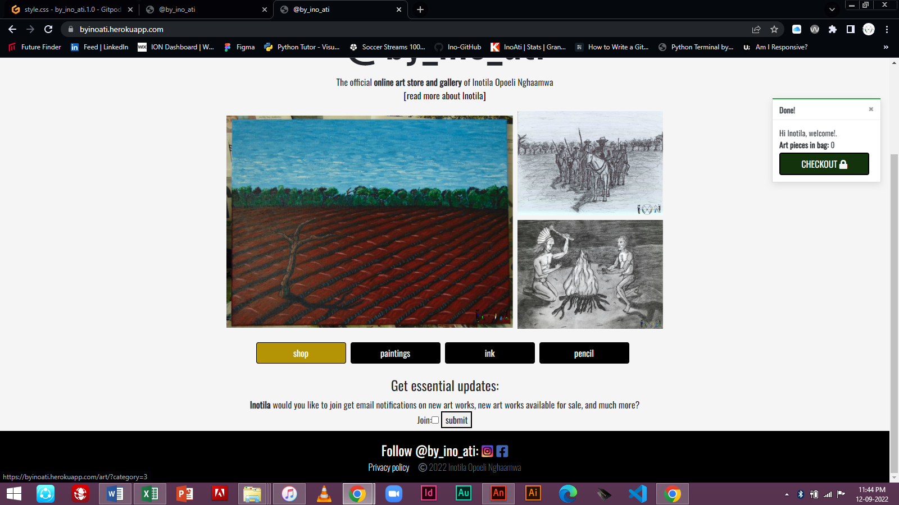
Figure 3.1: successful login

I signed-up, signed-in, and sign-out as user non-superuser in the front end to ensure that the post are rendering as expected, that all the pages are displaying with no broken links, and that the UI looks as intended. The signup function works, I could sign in and out (see Figure 3.1) without any issues.

### Home page test

Figure 4: Home page view

I started by testing that all the links in the navbar and the home page buttons work and lead to where they are intended and they did (see Figure 4). The logo will send you home, as will the home link in navbar. The shop, ink, painting, and pencil links in the navbar and the homepage buttons all lead to their respective pages.

### Art page test

Figure 5: Art page view for Paintings

 I test to see if all the art view were displaying and that the images were rendering properly (see Figure 5). All the images were rending properly.

### Like, comment, edit, and delete test

Figure 8: test comment

Figure 9: edited the text.

Figure 10: liked post

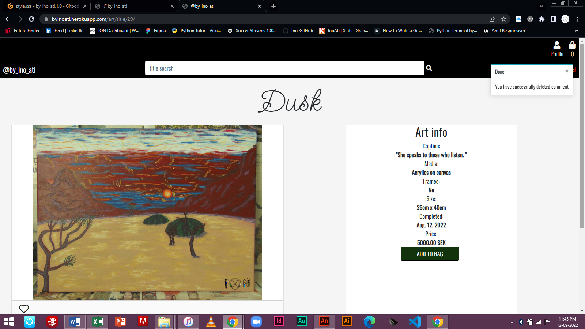
Figure 11: deleted the comment

I tested that like, comment, edit and delete buttons all work by going to the page of a single post and liked the post, created a comment, edited it and then deleted it. I created a test comment (see Figure 8). I then edited the text (see Figure 9).I liked the post, indicated by the red heart (see Figure 10). I then deleted the comment I edited earlier(see Figure 11).All of these buttons redirected me to the right page and executed exactly what I expected them to do in terms of CRUD functionality.

### Mailing list test
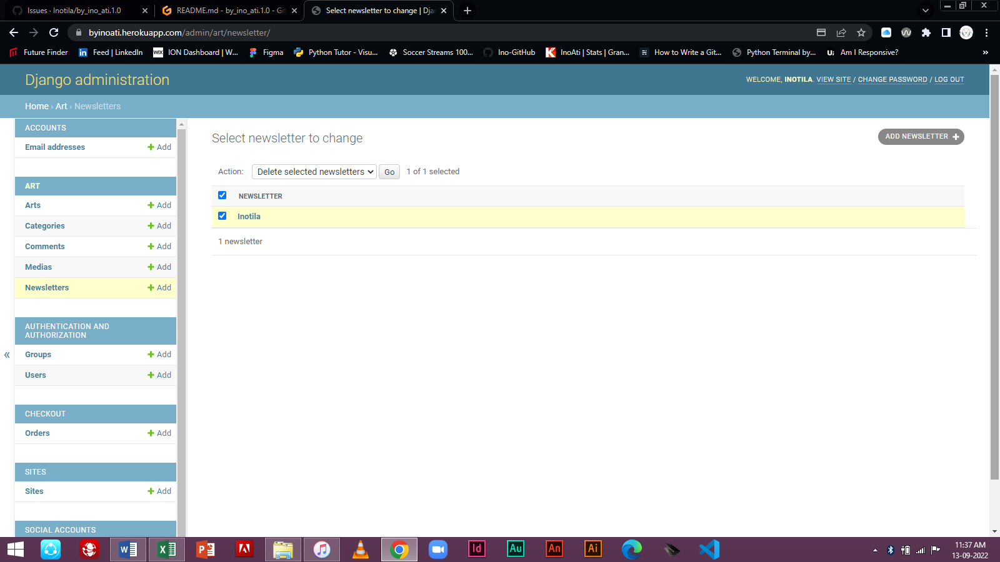
Figure 12: Mail list in the admin joined from the front end

For the mailing list I created a user name Inotila. Inotila was able to join the mail list by clicking the join option and then the submit button. After joining, i checked in the admin to see if the user was registered and he was (see Figure 12).

### Accessibility and performance test
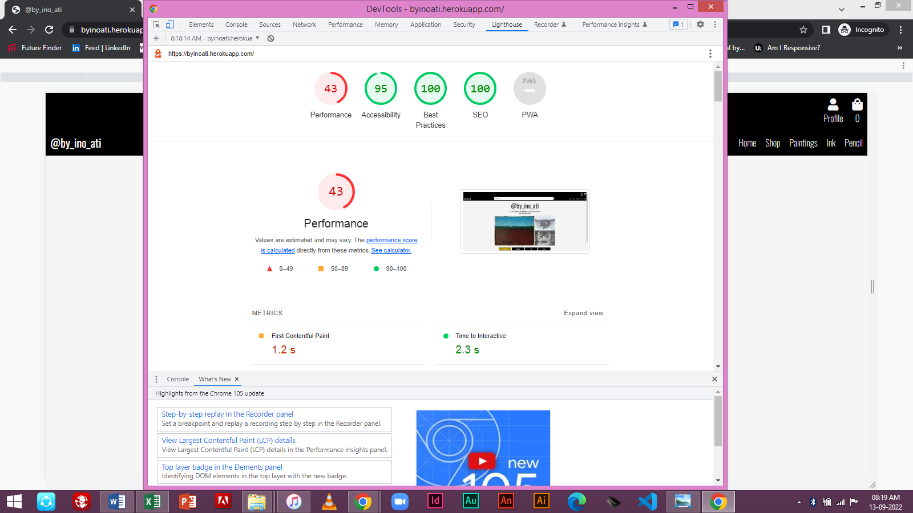
Figure 13: Lighthouse report

This app also meets the accessibility requirements of lighthouse in devtools. I ran it through light house and it got above 90% for all the criteria (see Figure 14).

## Wireframes and mock-ups

### Entity relationship diagram

I created this entity relationship diagram to guide me in creating my data structure in the models.

### Wireframes
I designed a high fidelity prototype for my wireframes Figma. This prototype has most of the fuctionality of that will be seen in the live site. However, during the developement of the live site I found certain pages required a different design either to the ones seen in the prototype. Furthermore, certain features in the prototype may be implimented in future releases. The prototype is availabe for testing here:  [Prototype](https://www.figma.com/proto/ovBwxM0RloJGWQoZdNKPAg/%40by_ino_ati?node-id=2%3A4&scaling=scale-down&page-id=0%3A1&starting-point-node-id=2%3A4)

#### Home view wireframe
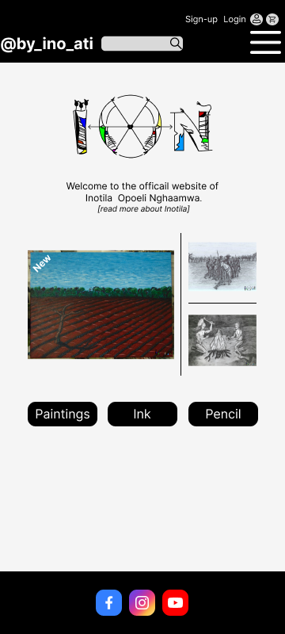

#### Bio wireframe
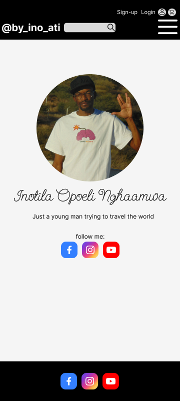

#### Art view wireframe
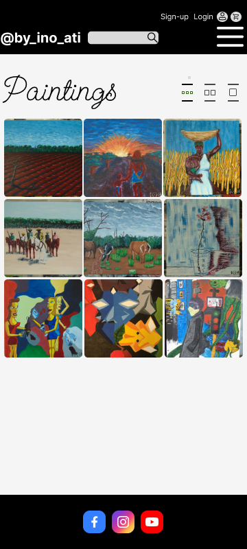

#### Second art view wireframe( might have)

#### Third art view wireframe( might have)

wireframes/
#### Details view wireframe

#### Payout and bag view wireframe
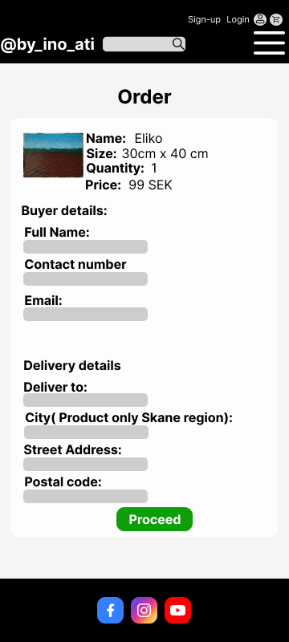

#### Checkout and bag view wireframe
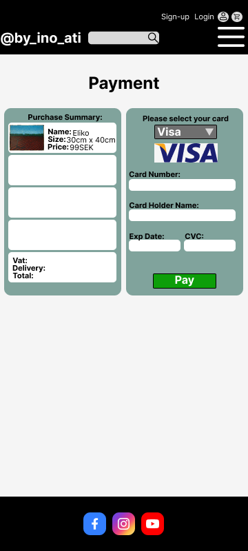

#### Thanks for payment view wireframe
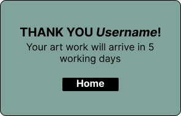

### Project task list 
I made a project task list to ensure I was aware of all the requirements and that all them were met (see figure A, B, and C). Below are the three list I worked with. 

Figure A - a list of the tasks that I had to perform to bring the app to life. 

Figure B - a list of the requirements to meet the pass criteria for the project. 

Figure C - a list of the requirements to meet the pass criteria for the project. 

## Bugs and fixes

### bug 1-sign up
The sign up page would not load after a user filled in all the details. Pressing submit would cause an error because allauth was trying to send an email to the email that the user would fill in.

### Solved bugs
To fix this error i added " EMAIL_BACKEND = 'django.core.mail.backends.console.EmailBackend' " to the back end.

## Unfixed bugs

None

## Validator testing

Html - No errors returned from the official w3c validator

CSS - No errors returned from the official (jigsaw) validator

Javascript - No errors returned from the jshint validator

Python - The only errors I have are for the line being too long, i opted not to put them on the next line because they were causing my app to fail. I also got an E701 error because I reversed the order od date by adding a " - " to my completed_on variable.

## Deployment

The live deployed application can be found at [by-ino-ati](https://by-ino-ati.herokuapp.com/).

### Heroku Deployment

This project uses [Heroku](https://www.heroku.com), a platform as a service (PaaS) that enables developers to build, run, and operate applications entirely in the cloud.

Deployment steps are as follows, after account setup:

- Select *New* in the top-right corner of your Heroku Dashboard, and select *Create new app* from the dropdown menu.
- Your app name must be unique, and then choose a region closest to you (EU or USA), and finally, select *Create App*.
- From the new app *Settings*, click *Reveal Config Vars*, and set the following key/value pairs:
  - `CLOUDINARY_URL` (insert your own Cloudinary API key here)
  - `DATABASE_URL` (this comes from the **Resources** tab, you can get your own Postgres Database using the Free Hobby Tier)
  - `SECRET_KEY` (this can be any random secret key)

Heroku needs two additional files in order to deploy properly.
- requirements.txt
- Procfile

You can install this project's requirements (where applicable) using: `pip3 install -r requirements.txt`. If you have your own packages that have been installed, then the requirements file needs updated using: `pip3 freeze --local > requirements.txt`

The Procfile can be created with the following command: `echo web: gunicorn byinoati.wsgi > Procfile`

For Heroku deployment, follow these steps to connect your GitHub repository to the newly created app:

Either:
- Select "Automatic Deployment" from the Heroku app.

Or:
- In the Terminal/CLI, connect to Heroku using this command: `heroku login -i`
- Set the remote for Heroku: `heroku git:remote -a <app_name>` (replace app_name with your app, without the angle-brackets)
- After performing the standard Git `add`, `commit`, and `push` to GitHub, you can now type: `git push heroku main`

The frontend terminal should now be connected and deployed to Heroku.

### Local Deployment

*Gitpod* IDE was used to write the code for this project.

To make a local copy of this repository, you can clone the project by typing the follow into your IDE terminal:
- `git clone https://github.com/Inotila/by_ino_ati.git`

You can install this project's requirements (where applicable) using: `pip3 install -r requirements.txt`.

Alternatively, if using Gitpod, you can click below to create your own workspace using this repository.

## Credits/Reference 
This work is the original work of Inotila Nghaamwa, however the following resources were used to supplement:

### Code
I used similar coding approaches to that which was used for the "I think and therefore I blog" project. Particularly the Post and comment method. I therefore added my own custom model in MailingList. In addition I used a similar timeout function to make the message alert timeout. 

### Media
All images used are the property of Inotila Nghaamwa.

### Credits 

Content -
Text-Written by Inotila Nghaamwa.

Images - All images used are the property of Inotila Nghaamwa.
